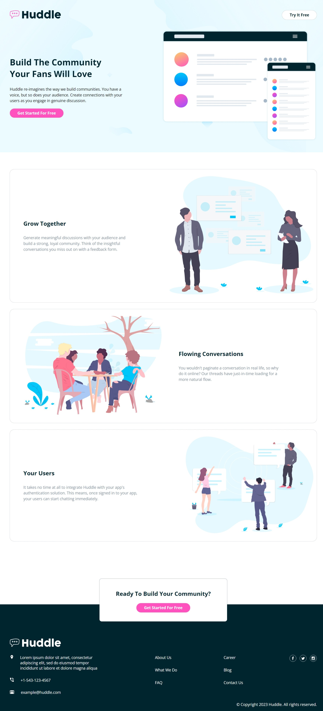

# Frontend Mentor - Huddle landing page with alternating feature blocks solution

This is a solution to the [Huddle landing page with alternating feature blocks challenge on Frontend Mentor](https://www.frontendmentor.io/challenges/huddle-landing-page-with-alternating-feature-blocks-5ca5f5981e82137ec91a5100). Frontend Mentor challenges help you improve your coding skills by building realistic projects. 

## Table of contents
  - [The challenge](#the-challenge)
  - [Screenshot](#screenshot)
  - [Links](#links)
  - [Built with](#built-with)
- [Author](#author)

### The challenge
Users should be able to:

- View the optimal layout for the site depending on their device's screen size
- See hover states for all interactive elements on the page

### Screenshot

### Links
- Solution URL: (https://github.com/Oppy09/huddle-landing-page-with-alternating-feature-blocks-master)
- Live Site URL: (https://oppy09.github.io/huddle-landing-page-with-alternating-feature-blocks-master/)

### Built with
- Semantic HTML5 markup
- CSS custom properties
- Flexbox
- Desktop-first workflow
## Author
- Frontend Mentor - [@Oppy09](https://https://www.frontendmentor.io/profile/Oppy09)
- Twitter - [@AderinolaOpemi5](https://https://www.twitter.com/AderinolaOpemi5)
